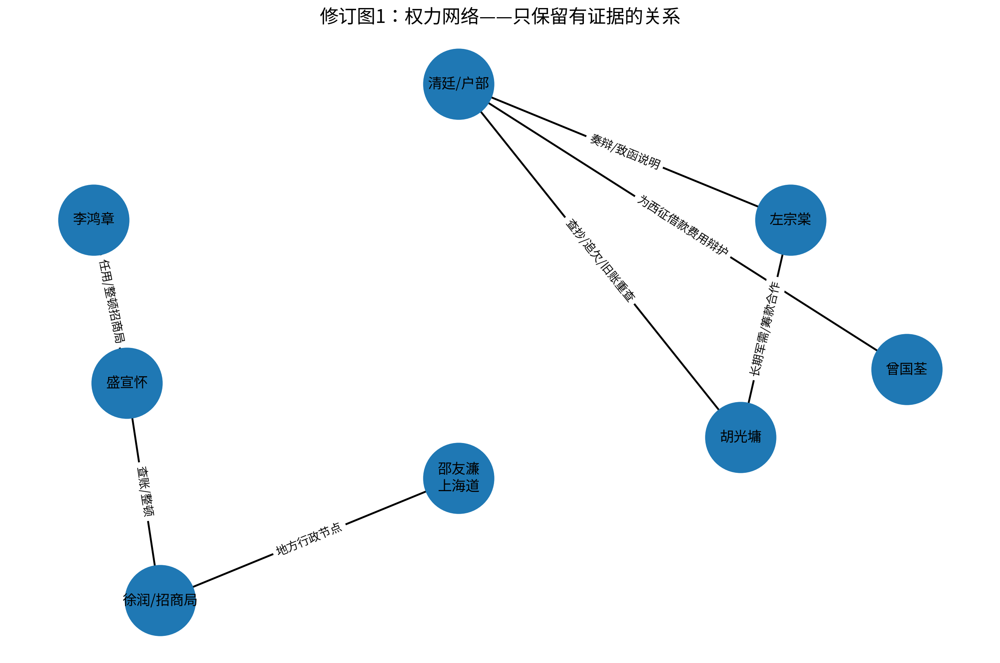
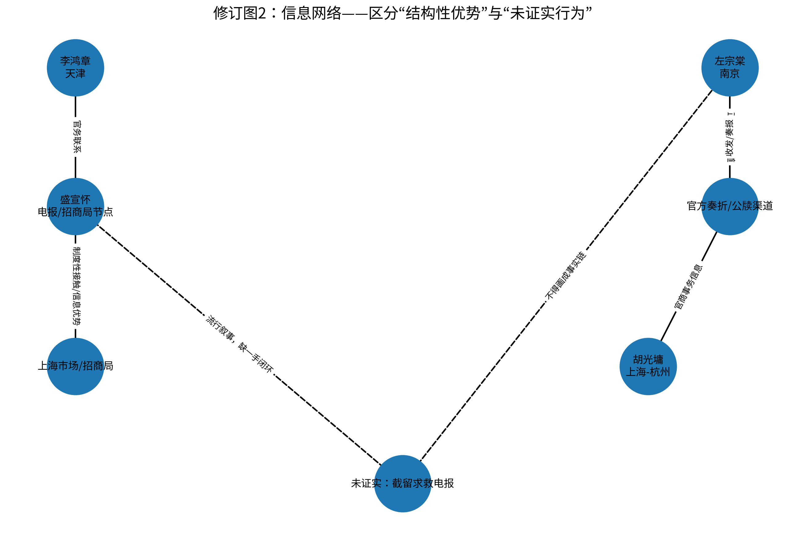
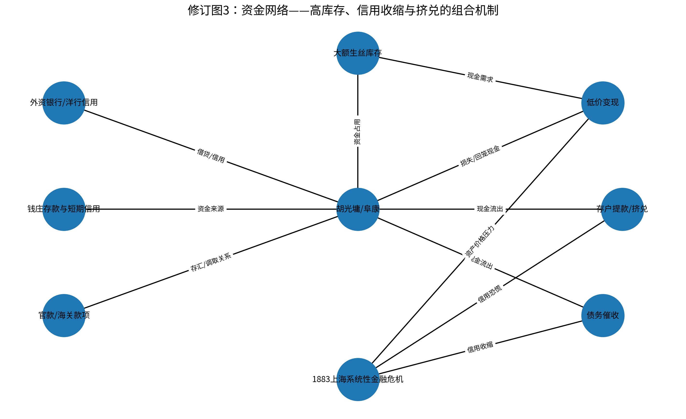
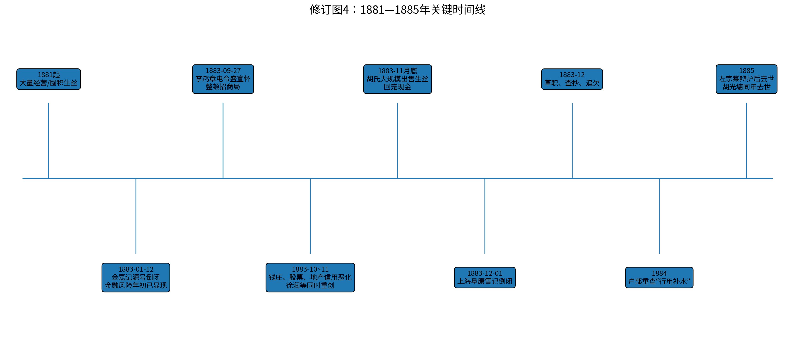

# 1883年胡雪岩破产案：OSINT证据链分析

**Case ID:** OSINT-CASE-001  
**Status:** OPEN — 核心机制部分确认，关键“定点政治清算”主张未证实  
**Language:** 中文  
**License:** CC BY-NC-SA 4.0

> 这是一个用于训练情报分析方法的公开来源情报（OSINT）案例。目标不是证明预设结论，而是区分**已证事实、结构性能力、合理推断、竞争性假设与未证实叙事**。

## Executive Assessment

当前证据较稳健地支持：

**1883年上海系统性金融危机 + 胡氏经营与流动性脆弱性 → 阜康体系崩溃 → 官方查抄、追欠与旧账重查进一步放大损失。**

当前公开证据**不足以确认**以下更强主张：

- 邵友濂奉命故意拖延协饷20天；
- “20天”是精确计算的资金攻击窗口；
- 盛宣怀截留胡光墉向左宗棠求救的电报；
- 李鸿章—盛宣怀预先设计了一套以电报、协饷和挤兑为工具的定点破产方案。

因此，本案例当前最稳健的工作假设是：

> **H3：市场与经营风险触发 + 行政财政机制事后放大。**

“预谋性定点政治打击”继续保留为待验证假设，而不写入事实层。

## Intelligence Question

1883年胡光墉（胡雪岩）破产，应如何区分以下机制的作用？

1. 上海系统性金融危机；
2. 胡氏生丝库存、信用依赖与流动性错配；
3. 李鸿章—盛宣怀等官商网络的制度性信息优势；
4. 胡氏破产后的清廷查抄、财政追索和西征借款“旧账”重查；
5. 后世“延饷20日”“截留求救电报”等叙事是否存在一手证据闭环。

## Key Analytical Products

- [完整报告：full_report_zh.md](full_report_zh.md)
- [分析方法：methodology.md](methodology.md)
- [ACH竞争性假设分析：ach.md](ach.md)
- [红队审查：red_team.md](red_team.md)
- [来源登记：source_register.csv](source_register.csv)
- [待核验档案：archive_targets.md](archive_targets.md)
- [版本与修订记录：PROVENANCE.md](PROVENANCE.md)

## 关键图表

### 1. 权力网络



### 2. 信息网络



### 3. 资金网络



### 4. 关键时间线



## Analytical Framework

本项目明确区分五个层级：

| 层级 | 含义 | 例子 |
|---|---|---|
| **F — Fact** | 有可靠材料直接支持 | 1883年上海出现大范围钱庄、商号危机 |
| **C — Capability** | 行为体具备某种结构性能力 | 盛宣怀在电报与招商局体系中具有信息与组织优势 |
| **I — Inference** | 基于事实作出的合理推断 | 这种制度位置可能提高其危机期间的信息可见度 |
| **H — Hypothesis** | 需要继续验证的竞争性解释 | 是否利用信息优势定点打击胡氏 |
| **U — Unverified** | 流行但缺少可靠一手闭环的叙事 | “截留求救电报”“精准拖延20天” |

> **Capability ≠ Action**  
> **Access ≠ Use**  
> **Chronology ≠ Causation**

## Current ACH Assessment

本案保留四个竞争性假设：

- **H1：系统性金融危机主导**
- **H2：预谋性政治打击主导**
- **H3：市场触发 + 制度/政治放大**
- **H4：胡氏自身经营决策主导**

当前公开证据与 **H3** 最一致，但其中“政治/制度放大”主要指**破产后的查抄、追欠及旧账重查**，而不是已经证明了破产前存在统一设计的“截报 + 延饷 + 定点挤兑”。

详见 [ach.md](ach.md)。

## 主要纠错

相较于初始版本，本案例作出以下关键修订：

1. 不再声称“政治清算贡献度显著高于市场因素”，因为现有历史材料无法识别反事实并量化贡献度。
2. 不再把“掌握电报或招商局资源”直接等同于“实际截报、监控资金或制造挤兑”。
3. 左宗棠1883年时任两江总督兼南洋通商大臣，不应描述为“远在西北、只能依赖驿路”。
4. 李鸿章1883年9月27日电令盛宣怀整顿招商局，现有材料直接说明的背景是上海市面紧张与招商局债务压力，不能直接推断为“打胡”。
5. 徐润等大商人与大量钱庄同期受创，是评估“单点打击”假说时必须纳入的背景与反证。
6. 胡氏破产后户部重新追查已奏销的西征借款“行用补水”等旧账，是目前政治—行政放大机制中较扎实的一组证据。
7. ACH不再按“支持证据条数”简单计票，而强调证据对不同假设的诊断性。

## Source Discipline

本项目采用以下来源分级：

| 等级 | 类型 | 使用原则 |
|---|---|---|
| **A1** | 原始档案、上谕、奏折、函电、账册 | 核心事实优先依据 |
| **A2** | 同时报刊、年谱、日记 | 用于还原时点与社会反应，需考虑立场和传闻 |
| **B** | 同行评议论文、学术专著、档案整理本 | 用于交叉考证与机制解释 |
| **C** | 晚清笔记、回忆、轶事 | 只能作为线索，必须交叉验证 |
| **D** | 通俗历史、网络文章、小说影视 | 不单独支撑关键事实 |

完整来源登记见 [source_register.csv](source_register.csv)。

## Key Public Sources

- 招商局历史博物馆：**《1883年上海金融风潮》**  
  https://1872.cmhk.com/shuyuan/195.html
- 招商局历史博物馆：**《从1885年盛宣怀入主招商局看晚清新式工商企业中的官商关系》**  
  https://1872.cmhk.com/shuyuan/321.html
- 吴烨舟：**《胡光墉破产案中的西征借款“旧账”清查》**，《近代史研究》2015年第4期  
  https://lsx.jnu.edu.cn/2016/0330/c1984a18138/page.psp
- 湖南省相关公开历史资料：左宗棠1881年出任两江总督兼南洋通商大臣  
  https://www.hnstb.gov.cn/plus/view-287-1.html
- 湖南省纪委监委公开历史资料：阎敬铭1882年任户部尚书并整顿部务  
  https://www.sxfj.gov.cn/jing_cai_zhuan_ti/267e63/10908389.shtml

## Collection Priorities

下一阶段优先寻找能够真正区分竞争假设的一手材料：

- 1883年9—12月李鸿章—盛宣怀往来函电中是否直接出现“胡光墉 / 阜康 / 协饷 / 上海道”等关键词；
- 邵友濂公牍中是否存在某笔协饷“延缓20日”的明确命令、日期、金额和理由；
- 电报局收发报记录中是否存在胡氏致左宗棠电报被拒发、缓发或扣留的记录；
- 汇丰、怡和等档案中，胡氏债务催收是否存在官员干预证据；
- 户部对“行用补水”旧账重新起案的承办、批转和决策链。

详见 [archive_targets.md](archive_targets.md)。

## Repository Structure

当前 Case 001 采用扁平结构，便于直接浏览：

```text
hu-xueyan-1883-osint/
├── README.md
├── full_report_zh.md
├── methodology.md
├── ach.md
├── red_team.md
├── source_register.csv
├── archive_targets.md
├── power_network.png
├── information_network.png
├── funding_network.png
├── timeline.png
├── LICENSE.md
├── CITATION.cff
├── PROVENANCE.md
├── MANIFEST.sha256
└── .gitignore
```

## Status & Limitations

**Case status: OPEN.**

目前可以较高置信度确认：
- 1883年上海存在严重系统性金融危机；
- 胡氏自身经营结构具有明显流动性脆弱性；
- 胡氏破产后存在持续的行政与财政追索。

目前仍未形成可靠一手证据闭环：
- “延饷20日”；
- “截留求救电报”；
- 李—盛统一策划、定点制造胡氏破产。

因此，本项目不会把这些主张作为既成事实。

## License

本仓库原创分析、文字和图表采用 **CC BY-NC-SA 4.0**。第三方史料、档案、网页及引用内容仍受其各自版权与使用条件约束。

详见 [LICENSE.md](LICENSE.md)。
